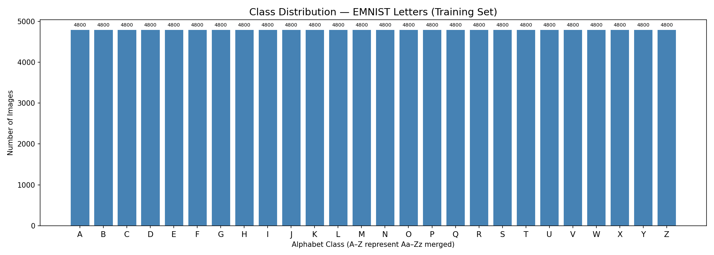
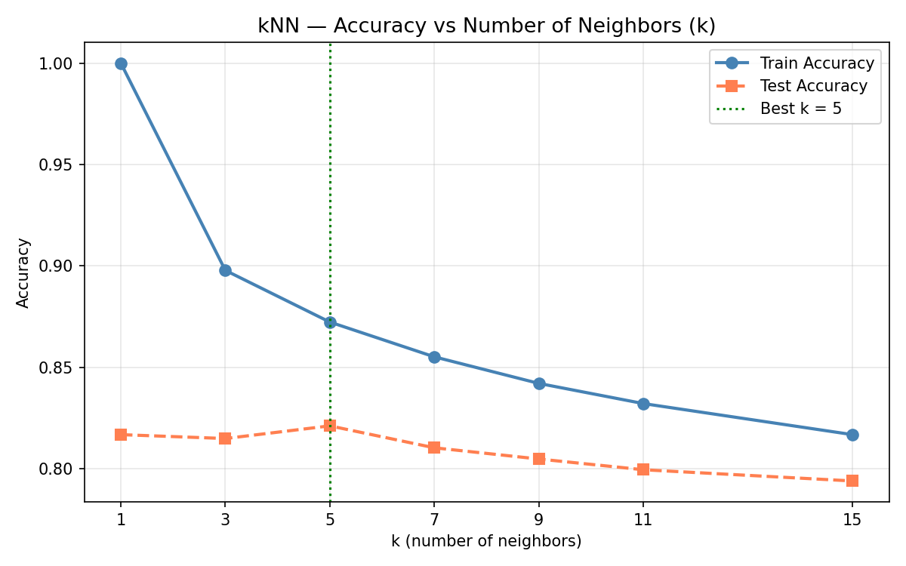
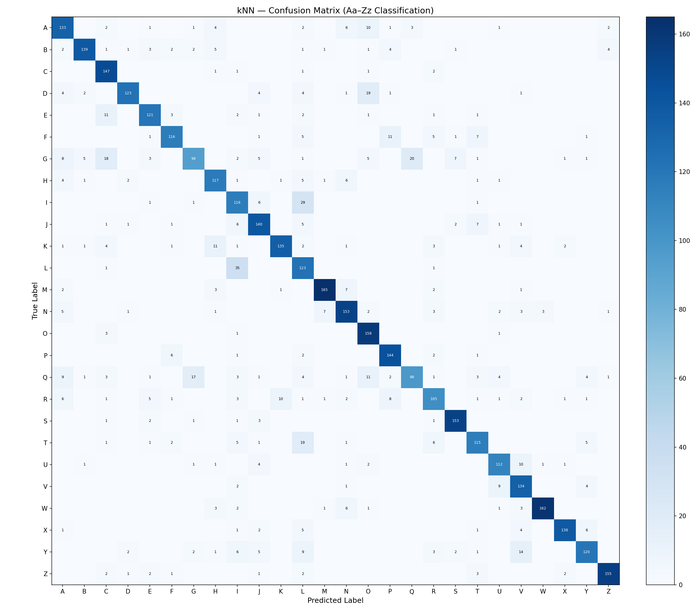
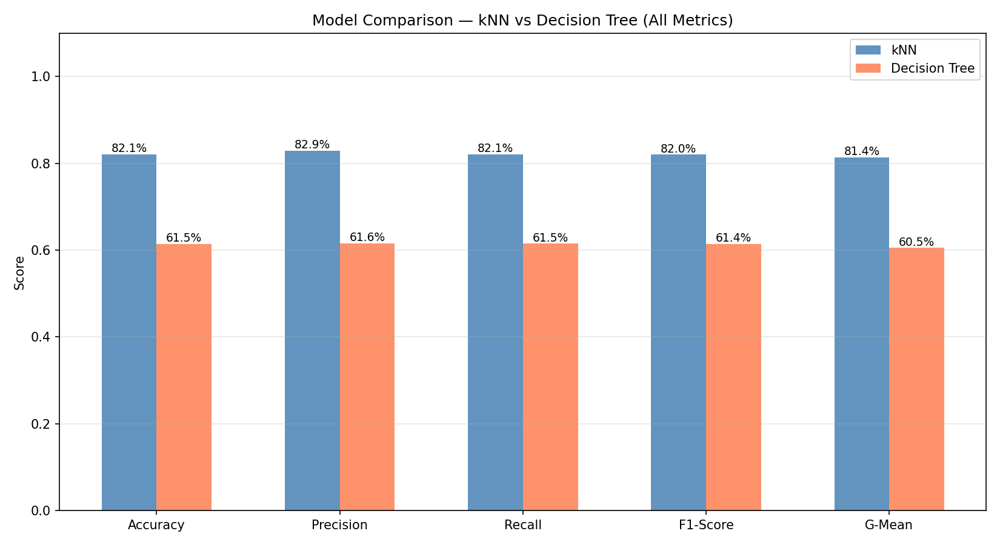

# HandWritten_Letters_Classifier
Handwritten alphabet classification (A–Z) using KNN and Decision Tree on EMNIST Letters dataset. Built with scikit-learn, achieving 82.12% accuracy with a live drawing GUI for real-time prediction.

## Team - DataCraft
Mahesh Kumar | Rajesh Kumar — Sukkur IBA University

## Project Overview
End-to-end handwritten alphabet classification system
using traditional machine learning algorithms.

## Results
| Model         | Accuracy | F1-Score | G-Mean  |
|---------------|----------|----------|---------|
| kNN (k=5)     | 82.12%   | 82.04%   | 81.42%  |
| Decision Tree | 61.47%   | 61.43%   | 60.52%  |

## Visualizations

## Dataset
EMNIST Letters — 124,800 training images, 26 classes
Download: https://www.kaggle.com/datasets/crawford/emnist

## Required Files
After extracting the zip, you only need these 4 files:
emnist-letters-train-images-idx3-ubyte
emnist-letters-train-labels-idx1-ubyte
emnist-letters-test-images-idx3-ubyte
emnist-letters-test-labels-idx1-ubyte

## Project Files
- data_loader.py — loads and preprocesses EMNIST dataset
- feature_extraction.py — flattens images to 784 feature vectors
- models.py — trains and tunes kNN and Decision Tree
- evaluation.py — confusion matrix and all metrics
- improvements.py — feature importance and error analysis
- drawing_gui.py — live drawing interface for real-time prediction

## Setup
Update DATA_PATH in every .py file to your local folder:
DATA_PATH = r"your\path\to\emnist_source_files"

## Requirements
pip install numpy pandas matplotlib scikit-learn pillow joblib
Python 3.6 or higher required

## How to Run
1. Download EMNIST Letters dataset
2. Update DATA_PATH in each file to your local path
3. Run files in order: data_loader → feature_extraction → models → evaluation → improvements → drawing_gui

## Research Finding
During this project we discovered that no reliable 52-class handwriting dataset exists for separating all uppercase and lowercase letters. Even NIST researchers themselves merged 15 visually ambiguous pairs in their Balanced dataset. This represents an open research problem in handwriting recognition.

## Why kNN Beats Decision Tree
kNN compares entire 784-pixel vectors at once — similar letters naturally have similar pixel patterns. Decision Tree makes sequential single-pixel decisions and cannot capture the spatial relationships that define letter shapes. This explains the 20.65% accuracy gap.

## Key Findings
- kNN outperforms Decision Tree by 20.65% on pixel image data
- Most confused pairs: L↔I, G↔Q (visually similar strokes)
- Live GUI achieves ~70% accuracy on mouse drawings

## License
MIT License — free to use with credit to Data Craft team.
